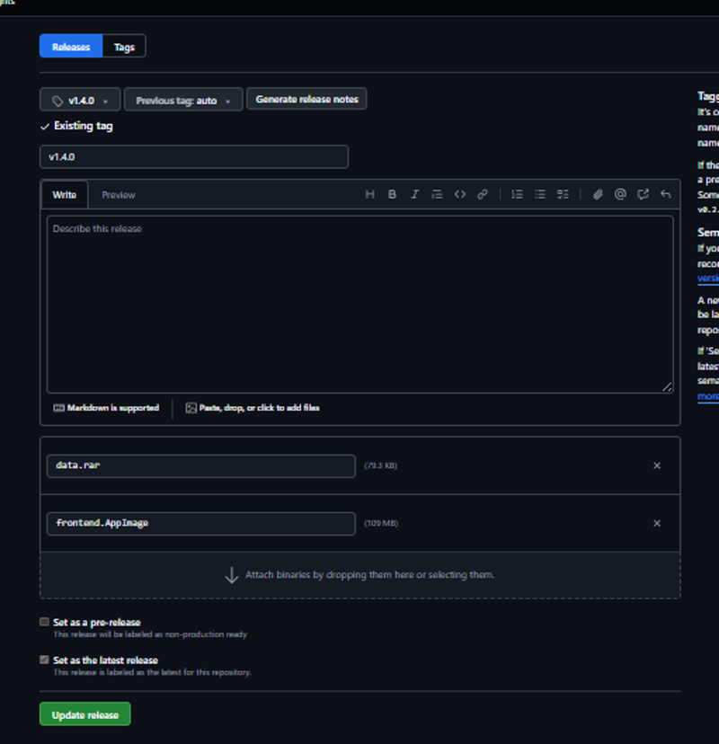
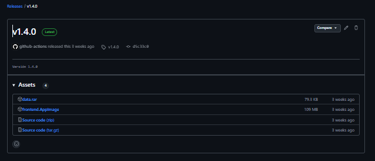

# DVM Front - Instalación y Versionado

Aplicación desarrollada por **Darkflow** para el cliente **DVM**. Se trata de un frontend de escritorio construido con **Electron** y **ReactJS**, diseñado para funcionar sobre dispositivos tipo tablet.

Repositorio del proyecto: [https://github.com/darkflowsrl/DVM-front](https://github.com/darkflowsrl/DVM-front)

## 🚀 Instalación

### Requisitos previos

- Node.js (v18 o superior recomendado)
- npm o pnpm

### Pasos para correr el proyecto en modo desarrollo

1. **Clonar el repositorio:**

```bash
git clone https://github.com/darkflowsrl/DVM-front
cd DVM-front
```

2. **Instalar las dependencias:**

Con `npm`:

```bash
npm install
```

O con `pnpm`:

```bash
pnpm install
```

3. **Levantar la aplicación en modo desarrollo:**

```bash
npm run dev
```

Esto iniciará la aplicación de escritorio localmente.

---

## 🧭 Versionado

### ¿Cómo se genera una nueva versión?

Para publicar una nueva versión, seguí estos pasos:

1. Crear un tag anotado:

```bash
git tag -a v1.4.0 -m "Versión 1.4.0"
```

2. Enviar el tag al repositorio remoto:

```bash
git push origin v1.4.0
```

Esto generará automáticamente una nueva release en GitHub, disponible en:

👉 [https://github.com/darkflowsrl/DVM-front/releases/tag/v1.4.0](https://github.com/darkflowsrl/DVM-front/releases/tag/v1.4.0)

3. Luego podés editarla y agregar los archivos correspondientes (por ejemplo, `data.rar`) desde:

👉 [https://github.com/darkflowsrl/DVM-front/releases/edit/v1.4.0](https://github.com/darkflowsrl/DVM-front/releases/edit/v1.4.0)


El versionado del proyecto se maneja mediante **tags de Git**, siguiendo el formato semántico:

```
v{major}.{minor}.{patch}
```

Ejemplo de versión: `v1.4.0`

Las versiones pueden consultarse en la sección de releases del repositorio:

👉 [https://github.com/darkflowsrl/DVM-front/releases](https://github.com/darkflowsrl/DVM-front/releases)

### Archivos incluidos en una release

Cada release contiene:

- `frontend.AppImage`: binario ejecutable para Linux.
- `data.rar`: archivo con la información inicial de la aplicación.

> ⚠️ **Importante**: El archivo `data.rar` debe colocarse en un directorio con permisos de lectura y escritura. Esto permite que la aplicación pueda modificar el contenido desde la tablet.

---

## 📦 Scripts disponibles

En el `package.json`, se incluyen diversos comandos útiles:

| Script | Descripción |
|--------|-------------|
| `npm run dev` | Corre la app en modo desarrollo |
| `npm run build` | Construye la aplicación |
| `npm run build:win` | Genera ejecutable para Windows |
| `npm run build:mac` | Genera ejecutable para Mac |
| `npm run build:linux` | Genera `.AppImage` para Linux |
| `npm run typecheck` | Revisa tipos TypeScript |
| `npm run lint` | Lint del código fuente |
| `npm run format` | Formatea el código con Prettier |

---

## 🛠️ Dependencias destacadas

- `electron`
- `react`
- `react-router-dom`
- `zustand`
- `socket.io`
- `electron-updater`
- `electron-log`
- `tailwindcss`

---

## 📄 Información adicional

- La app está escrita con **TypeScript**
- Usa **Electron Vite** como herramienta de empaquetado y desarrollo
- Interfaz moderna y modular con React y Tailwind

---

## 📬 Contacto

Este proyecto es mantenido por el equipo de **Darkflow**.

Para más información técnica o soporte, consultá el repositorio oficial o contactate con los desarrolladores a través del mismo.

---

## 🖼️ Ejemplo visual - Subida de una release

A continuación, una captura de pantalla del proceso de edición de una versión (release) en GitHub, donde se adjunta el archivo `data.rar` **"Update release"**:



## 📦 Ejemplo visual - Release publicada

Una vez completada la edición, la release se ve así en GitHub. Contiene los archivos `data.rar`, `frontend.AppImage` y el código fuente comprimido:

